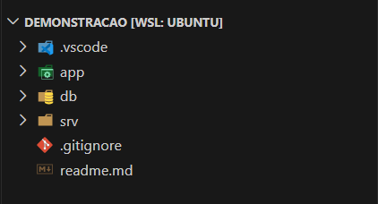
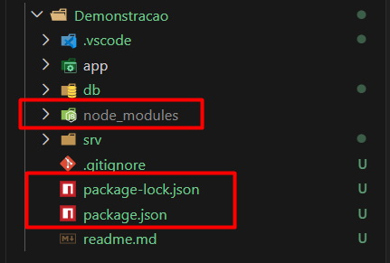
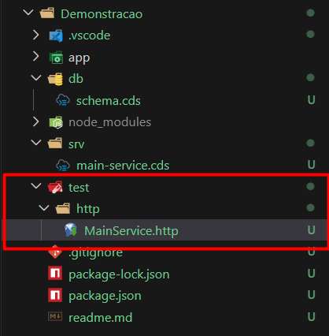

## 01. Iniciando projeto

``` bash
cds init
```

### Estrutura de Pastas Criadas:



- **app**: Aplicativos Fiori/Front-End
- **db**: Camada de persistência/definições das entidades
- **srv**: Camada de serviços/lógicas de negócios

## 01.1 Adicionando o NodeJS ao projeto

``` bash
cds add nodejs

npm install
```


## 02. Criando Schema

#### db/schema.cds

``` CDS
namespace cap.schema;

entity User {
    key ID        : UUID;
        email     : String(100);
        firstName : String(100);
        lastName  : String(100);
}
```

## 03. Criando Service

### *Exposição dos serviços*
#### srv/main-service.cds

``` CDS
using {cap.schema as db} from '../db/schema';

service MainService {
    entity Users as projection on db.User;
}
```

- CRUD implementado automaticamente (customizável)
- Path padrão **http(s)://host:port/odata/v4/serviceName/EntityType** (http://localhost:4004/odata/v4/main/Users)

## 03.01 Atualizando Path

#### Adicionando a Annotation *@Path*

``` CDS
using {cap.schema as db} from '../db/schema';

@path: '/users-api'
service MainService {
    entity Users as projection on db.User;
}
```

- path muda para: http://localhost:4004/users-api/Users

## 04. Adicionando Testes de Rotas

``` bash
cds add http
```



### Testes prontos
``` http
@server=http://localhost:4004
@username=alice
@password=

### Users
# @name Users_GET
GET {{server}}/users-api/Users
Authorization: Basic {{username}}:{{password}}

### Users
# @name Users_POST
POST {{server}}/users-api/Users
Content-Type: application/json
Authorization: Basic {{username}}:{{password}}

{
  "ID": "2253001e-ecec-4e02-9ad5-dd5f26f6ee46",
  "email": "email-2253001",
  "firstName": "firstName-2253001",
  "lastName": "lastName-2253001"
}

### Users
# @name Users_PATCH
PATCH {{server}}/users-api/Users/2253001e-ecec-4e02-9ad5-dd5f26f6ee46
Content-Type: application/json
Authorization: Basic {{username}}:{{password}}

{
  "ID": "2253001e-ecec-4e02-9ad5-dd5f26f6ee46",
  "email": "email-2253001",
  "firstName": "firstName-2253001",
  "lastName": "lastName-2253001"
}

### Users
# @name Users_DELETE
DELETE {{server}}/users-api/Users/2253001e-ecec-4e02-9ad5-dd5f26f6ee46
Content-Type: application/json
Authorization: Basic {{username}}:{{password}}
```

## 05. Criando Validação de Input

#### Validando E-Mail único

``` CDS
namespace cap.schema;

@assert.unique: {email: [email]}

entity User {
    key ID        : UUID;
        email     : String(100);
        firstName : String(100);
        lastName  : String(100);
}
```

- Caso tente cadastrar um e-mail já cadastrado, retornará o erro:
``` http
HTTP/1.1 500 Internal Server Error 
X-Correlation-ID: 65c84535-59ab-46ce-99f1-b283507c8224 
OData-Version: 4.0 
Content-Type: application/json; charset=utf-8 
Content-Length: 125 
Date: Mon, 20 Jul 2026 20:00:39 GMT 
Connection: close 

{ "error": { 
	"message": "UNIQUE constraint failed: cap_schema_User.email", "code": "ERR_SQLITE_ERROR", "@Common.numericSeverity": 4 
	} 
}
```

#### Validando formato de entrada

``` CDS
namespace cap.schema;

@assert.unique: {email: [email]}

entity User {
    key ID        : UUID;

        @assert.format        : '^[A-Za-z0-9._%+-]+@[A-Za-z0-9.-]+\.[A-Za-z]{2,}$'
        @assert.format.message: 'E-mail inválido. Por favor, insira um e-mail válido.'
        email     : String(100);
        firstName : String(100);
        lastName  : String(100);
}
```

-  `@assert.format` garante que o dado deve ser um e-mail válido (user@sap.com);
- `@assert.format.message` define uma mensagem padrão caso o input não seja valido;
- Mensagem tratada:
``` http
HTTP/1.1 400 Bad Request 
X-Correlation-ID: 995e900a-ddaf-48fd-ba4e-1027186c1513 
OData-Version: 4.0 
Content-Type: application/json; charset=utf-8 
Content-Length: 146 
Date: Mon, 20 Jul 2026 20:24:44 GMT 
Connection: close 

{ "error": { 
	"message": "E-mail inválido. Por favor, insira um e-mail válido.", "code": "ASSERT_FORMAT", "target": "email", "@Common.numericSeverity": 4 
	} 
}
```

## 06. Integração com serviço externo

#### 06.1 Adicionar a configuração da API externa, pode ser no package.json, .cdsrc.json ou .cdsrc.yaml

``` yaml
cds:
  require:
    STAR_WARS_API:
      kind: rest
      credentials:
        url: https://swapi.dev/api
```

#### 06.2 Adicionando a função ao serviço

Uma ***function*** é um método customizado que age como um endpoint do tipo **GET**.

``` CDS
using {cap.schema as db} from '../db/schema';

@path: '/users-api'
service MainService {
    entity Users as projection on db.User;
    
    function getPersonById(id: Integer) returns {
        person : {
            name   : String;
            height : String;
            mass   : String;
            gender : String;
        }
    }
}
```

#### 06.3 Implementando a função e chamando a API externa

``` JavaScript
import cds from '@sap/cds';

export default (service) => {
    service.on('getPersonById', async (req) => {
        const { id } = req.data;
        const swapi = await cds.connect.to('STAR_WARS_API');
        const response = await swapi.get(`/people/${id}/`);
        
        return {
            person: {
                name: response.name,
                height: response.height,
                mass: response.mass,
                gender: response.gender
            }
        }
    });
};
```

#### 06.4 Chamando endpoint

Adicionando o caso de teste ao arquivo .http

``` http
### getPersonById
# @name getPersonById_GET
GET {{server}}/users-api/getPersonById(id=1)
Authorization: Basic {{username}}:{{password}}
```

Response:

``` http
HTTP/1.1 200 OK 
X-Correlation-ID: dcb6400c-fd33-49ee-9d12-b6425121c698 
OData-Version: 4.0 
Content-Type: application/json; charset=utf-8 
Content-Length: 153 
Date: Tue, 21 Jul 2026 11:45:21 GMT 
Connection: close 

{ "@odata.context": "$metadata#MainService.return_MainService_getPersonById", "person": { 
	"name": "Luke Skywalker", 
	"height": "172", 
	"mass": "77", 
	"gender": "male" 
	} 
}
```