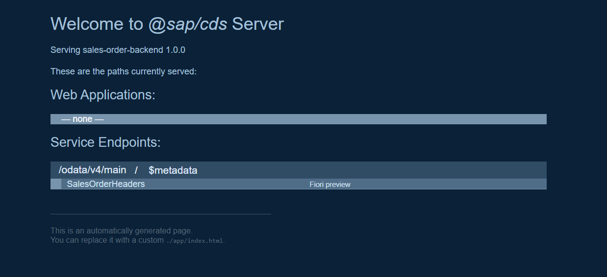
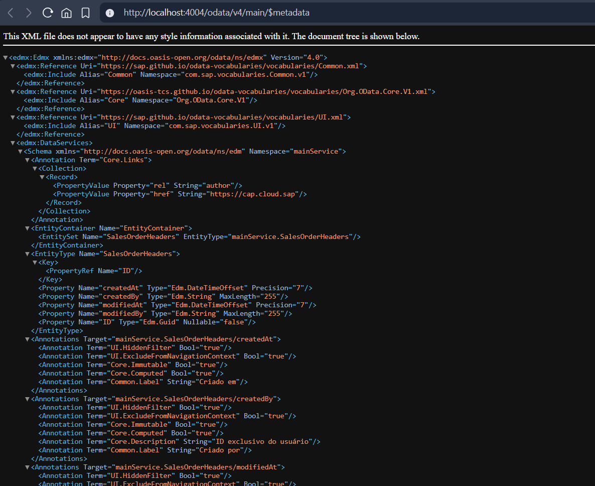

# Expondo Entidade

## Exposição de uma Entidade como serviço OData

### 01. Criando o Arquivo `main-service.cds`

Todos os serviços são criados dentro da pasta **srv**, e seguem o padrão {{NomeEntidade}}-service.cds, nesse exemplo mais genérico, pode ser usado o **main-service**, pois irá armazenar mais de uma serviço.

``` CDS
using {sales as db} from '../db/schema';

service mainService {
    entity SalesOrderHeaders as projection on db.SalesOrderHeaders;
}
```

### 02. Executando o Projeto

Para executar o projeto é possível usar dois comandos do **CAP**.

- `cds watch`: Para ambiente de desenvolvimento e testes, reseta o server automaticamente quando um arquivo é atualizado.
- `cds serve`: Para ambiente produtivo, não monitora os arquivos enquanto está em execução.

### 03. Verificando Endpoint e Meta Dados

Após executar o programa com um dos comandos, uma página será exibido browser, contendo as informações de serviços, apps Fiori e seus meta dados, usando o parâmetro `$metadata` na URL.



- **Web Applications**: Páginas Fiori / Front-End
- **Service Endpoints**: Endpoints dos serviços **OData**

Para verificar os metadados de um serviço, usamos o `$metadata` como parâmetro no **OData**



### 04. Testando o CRUD:

``` http
@Server=localhost:4004
@Entity=SalesOrderHeaders

GET http://{{Server}}/odata/v4/main/{{Entity}}
Content-Type: application/json

###

POST http://{{Server}}/odata/v4/main/{{Entity}}
Content-Type: application/json

###  

PATCH http://{{Server}}/odata/v4/main/{{Entity}}(ID=5336100b-bb59-4b32-8331-69179f5b74e5)
Content-Type: application/json

{
    "ID": "12345"
}

###

DELETE http://{{Server}}/odata/v4/main/{{Entity}}(ID=5336100b-bb59-4b32-8331-69179f5b74e5)
Content-Length: 0
```
